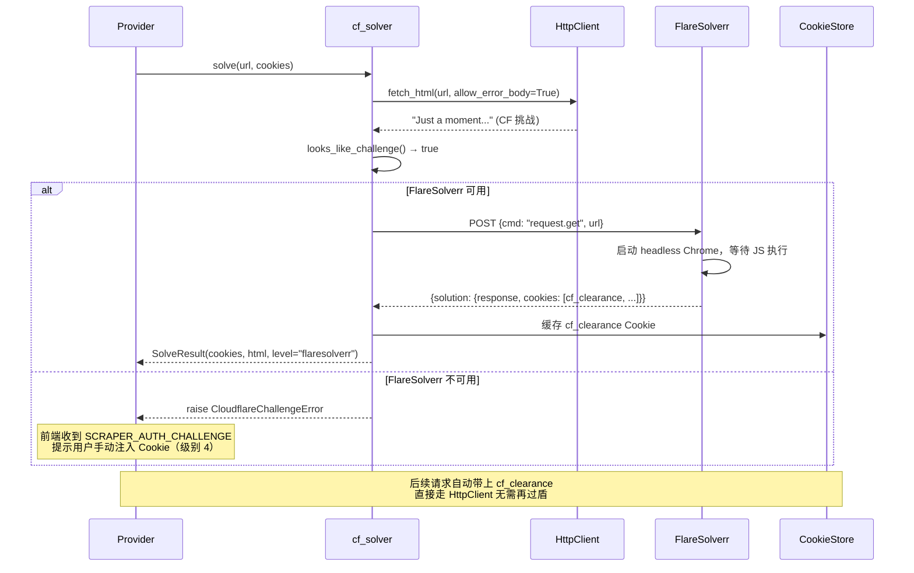

# FlareSolverr 集成方案（CF 级别 2 解盾）

> **日期**: 2026-02-15 | **预估**: 1–2 天

### 执行前置条件

| # | 条件 | 当前状态 | 阻塞？ |
|:-:|------|---------|:------:|
| 1 | `codex/scraper-v2-refactor-20260215` 分支合入 `main` | ⏳ 待合并（`personal` remote 已推送，`origin` 403 需权限） | **是** |
| 2 | `main` 下存在 `scraper_v1/http_client.py`、`cf_solver.py` 等 v2 文件 | ❌ 仅在工作树分支中 | **是** |
| 3 | 82 服务器代码同步到合并后的最新 `main` | ⏳ 需在条件 1 完成后执行 | **是** |

> [!CAUTION]
> 本方案所有代码修改均基于 scraper v2 分支（`codex/scraper-v2-refactor-20260215`）。在该分支合入 `main` 之前，**不可直接在 `main` 上执行**。下方文件路径均使用相对路径格式 `scraper_v1/xxx.py`，对应工作树中的 `manga_translator/server/scraper_v1/xxx.py`。

---

## 一、背景与实测证据

2026-02-15 对 `https://www.toongod.org/webtoon/teacher-yunji/` 实测：

| 引擎 | 结果 | 含义 |
|------|------|------|
| aiohttp 原生 | `Can not decode content-encoding: br` | 连响应都解析不了 |
| curl_cffi (impersonate=chrome120) | **403 → 7713 bytes `"Just a moment..."`** | TLS 指纹通过，但触发 JS 5 秒盾 |
| cf_solver.solve() | `ClientResponseError: 403` 异常 | **Bug：拿不到 HTML 就崩了** |

**结论**：级别 1（TLS 伪装）对此站不够，需要级别 2（FlareSolverr 执行 JS）来拿到 `cf_clearance` Cookie。

---

## 二、需修复的 Bug（前置条件）

### Bug：`http_client.fetch_html()` 丢弃 403 响应体

```python
# http_client.py:205-206 — 当前行为
status = int(response.status_code)
if status >= 400:
    raise self._client_error(url, status, response.headers)  # HTML 被丢弃
```

`cf_solver` 需要拿到 403 响应的 HTML 内容来判断是"CF 挑战"还是"真正拒绝"，但当前实现直接抛异常。

#### [MODIFY] `scraper_v1/http_client.py`

参数传播路径设计（3 层）：

```
fetch_html(allow_error_body=False)          ← 公开 API，cf_solver 传 True
  └→ _request_text(allow_error_body)        ← 分发层，透传参数
       ├→ _request_text_curl_cffi(allow_error_body)   ← curl_cffi 实现
       └→ _request_text_aiohttp(allow_error_body)     ← aiohttp 实现（含 raise_for_status）
```

**1) `fetch_html` 签名变更：**

```diff
  async def fetch_html(
      self,
      url: str,
      *,
      cookies: dict[str, str] | None = None,
      user_agent: str | None = None,
      referer: str | None = None,
+     allow_error_body: bool = False,
  ) -> str:
```

**2) `_request_text` 内部分发（约 line 169）：**

```diff
- return await self._request_text_curl_cffi(method, url, ...)
+ return await self._request_text_curl_cffi(method, url, ..., allow_error_body=allow_error_body)
  ...
- return await self._request_text_aiohttp(method, url, ...)
+ return await self._request_text_aiohttp(method, url, ..., allow_error_body=allow_error_body)
```

**3) `_request_text_curl_cffi`（约 line 201）：**

```diff
  async def _request_text_curl_cffi(
-     self, method, url, *, data, cookies, headers, timeout_sec
+     self, method, url, *, data, cookies, headers, timeout_sec, allow_error_body=False
  ) -> str:
      ...
      status = int(response.status_code)
      text = response.text
      if status >= 400:
+         if allow_error_body:
+             return text
          raise self._client_error(url, status, response.headers)
      return text
```

**4) aiohttp 路径（约 line 185）：**

```diff
  async with session.request(...) as response:
      text = await response.text()
-     response.raise_for_status()
+     if response.status >= 400:
+         if allow_error_body:
+             return text
+         raise self._client_error(url, response.status, response.headers)
      return text
```

> [!IMPORTANT]
> - `allow_error_body` **默认 `False`**：所有现有调用点行为不变
> - **仅 `cf_solver.solve()` 传 `True`**，其他地方禁止使用
> - `fetch_binary()` 和 `download_to_file()` 不受影响（它们有独立的错误处理）

#### [MODIFY] `scraper_v1/cf_solver.py`

```diff
  async def solve(self, url, *, current_cookies, user_agent, referer=None):
-     html = await self.http_client.fetch_html(url, ...)
+     html = await self.http_client.fetch_html(url, ..., allow_error_body=True)
      if not looks_like_challenge(html):
          return SolveResult(cookies=current_cookies, html=html, level_used="http_client")
```

---

## 三、FlareSolverr 集成设计

### 3.1 架构



### 3.2 FlareSolverr 部署（Docker sidecar）

#### [NEW] `deploy/flaresolverr/docker-compose.yml`

```yaml
version: "3.8"
services:
  flaresolverr:
    image: ghcr.io/flaresolverr/flaresolverr:v3.4.6  # 固定版本，避免 latest 行为漂移
    container_name: flaresolverr
    restart: unless-stopped
    environment:
      - LOG_LEVEL=info
      - TZ=Asia/Shanghai
      - CAPTCHA_SOLVER=none       # 不使用付费验证码服务
      - HEADLESS=true
    ports:
      - "127.0.0.1:8191:8191"     # 仅绑定 localhost，不暴露公网
    mem_limit: 512m               # 限制内存避免 Chrome 膨胀
    # 注：deploy.resources 仅在 Docker Swarm 下生效，普通 docker compose 靠 mem_limit 限制内存
    deploy:
      resources:
        limits:
          memory: 512M
```

启动方式：

```bash
cd deploy/flaresolverr && docker compose up -d
```

#### 后端配置

仅需设置一个环境变量：

```bash
# systemd drop-in 或 shell 环境
FLARESOLVERR_URL=http://localhost:8191/v1
```

> [!NOTE]
> 不设置此变量时，cf_solver 自动跳过 FlareSolverr，退化为级别 4（人在回路）。**零侵入性**。

### 3.3 cf_solver 增强

#### [MODIFY] `scraper_v1/cf_solver.py`

在当前 84 行骨架基础上增强以下能力：

**A. Cookie 缓存集成**

```python
class CloudflareSolver:
    def __init__(self, http_client, cookie_store: CookieStore | None = None):
        ...
        self._cookie_store = cookie_store

    async def solve(self, url, *, current_cookies, user_agent, referer=None):
        # 1. 先检查缓存是否有有效的 cf_clearance
        domain = urlparse(url).hostname or ""
        if self._cookie_store:
            cached = self._cookie_store.get_cookies(domain)
            if "cf_clearance" in cached:
                merged = {**current_cookies, **cached}
                html = await self.http_client.fetch_html(
                    url, cookies=merged, user_agent=user_agent,
                    allow_error_body=True,
                )
                if not looks_like_challenge(html):
                    return SolveResult(cookies=merged, html=html, level_used="cached")

        # 2. curl_cffi 直连尝试
        html = await self.http_client.fetch_html(
            url, cookies=current_cookies, user_agent=user_agent,
            allow_error_body=True,
        )
        if not looks_like_challenge(html):
            return SolveResult(cookies=current_cookies, html=html, level_used="http_client")

        # 3. FlareSolverr 解盾
        if self.flaresolverr_url:
            solved = await self._solve_with_flaresolverr(url=url, user_agent=user_agent)
            if solved is not None:
                # 缓存拿到的 cf_clearance
                if self._cookie_store and solved.cookies:
                    self._cookie_store.update_cookies(domain, solved.cookies)
                return solved

        # 4. 全部失败 → 抛异常触发人在回路
        raise CloudflareChallengeError(
            f"CF 挑战无法自动解决，请手动注入 Cookie (domain={domain})"
        )
```

**B. FlareSolverr 超时与重试**

```python
async def _solve_with_flaresolverr(self, *, url, user_agent) -> SolveResult | None:
    for attempt in range(2):  # 最多重试 1 次
        try:
            timeout = aiohttp.ClientTimeout(total=60)  # CF 5秒盾实际可能 10-15s
            payload = {
                "cmd": "request.get",
                "url": url,
                "maxTimeout": 45000,    # FlareSolverr 内部超时
                "userAgent": user_agent,
            }
            async with aiohttp.ClientSession(timeout=timeout) as session:
                async with session.post(self.flaresolverr_url, json=payload) as resp:
                    if resp.status >= 500 and attempt == 0:
                        await asyncio.sleep(2)
                        continue    # 重试
                    if resp.status >= 400:
                        return None
                    body = await resp.json()
            ...  # 解析 solution（现有逻辑保留）
        except (asyncio.TimeoutError, aiohttp.ClientError):
            if attempt == 0:
                await asyncio.sleep(2)
                continue
            return None
```

### 3.4 调用方集成点

当前 Provider 函数（search/catalog/chapters/reader_images）在遇到 CF 时直接抛 `CloudflareChallengeError`。需要在 Provider 调用前加一层自动解盾：

#### [MODIFY] `routes/v1_scraper.py`

在路由层为每个请求自动尝试解盾：

```python
async def _fetch_with_cf_solve(provider_fn, ctx: ProviderContext, target_url: str, *args):
    """包装 Provider 函数，遇 CF 挑战自动解盾后重试
    
    target_url: 当前请求的精确 URL（manga/chapter），优先用于 CF 解盾，
                比 base_url 的命中率更高。
    """
    try:
        return await provider_fn(ctx, *args)
    except CloudflareChallengeError:
        solver = _get_cf_solver()
        # 优先用目标 URL 解盾，回退到 base_url
        result = await solver.solve(
            target_url or ctx.base_url,
            current_cookies=ctx.cookies,
            user_agent=ctx.user_agent,
        )
        # 用解盾后的 cookies 重试一次
        new_ctx = ProviderContext(
            **{**ctx.__dict__, "cookies": {**ctx.cookies, **result.cookies}}
        )
        return await provider_fn(new_ctx, *args)
```

```diff
  # search endpoint — search 没有精确目标 URL，传 base_url 作为 target_url
- items = await provider.search(base_url, req.keyword, ...)
+ items = await _fetch_with_cf_solve(
+     _provider_search_compat, ctx, base_url, provider, req.keyword
+ )

  # catalog endpoint — 目标 URL 为 catalog_path
- items, has_more = await provider.catalog(base_url, page, orderby, catalog_path, ...)
+ items, has_more = await _fetch_with_cf_solve(
+     _provider_catalog_compat, ctx, target_url, provider, page, orderby, catalog_path
+ )
+
+ # chapters endpoint — 有精确 manga_url
- items = await provider.chapters(base_url, manga_url, ...)
+ items = await _fetch_with_cf_solve(
+     _provider_chapters_compat, ctx, manga_url, provider, manga_url
+ )
```

---

## 四、文件变动总览

| 文件 | 操作 | 改动量 |
|------|------|:------:|
| `scraper_v1/http_client.py` | MODIFY | ~15 行 |
| `scraper_v1/cf_solver.py` | MODIFY（增强） | ~60 行 |
| `routes/v1_scraper.py` | MODIFY（加 `_fetch_with_cf_solve`） | ~25 行 |
| `deploy/flaresolverr/docker-compose.yml` | NEW | ~18 行 |
| `deploy/systemd/manga-translator.service` 或 drop-in conf | MODIFY | +2 行（`Environment=`） |

---

## 五、验证计划

### 自动化测试

```bash
# 现有门禁不能回归
cd /Users/xa/Desktop/projiect/worktrees/manga-translator-ui_scraper-v2-20260215
python -m pytest tests/test_v1_scraper_phase2.py tests/test_v1_scraper_phase3.py tests/test_v1_scraper_phase4.py -v
```

### 新增单元测试

| 测试用例 | 覆盖点 |
|---------|--------|
| `test_fetch_html_allow_error_body_returns_html_on_403` | http_client 不抛异常，返回 HTML |
| `test_fetch_html_default_raises_on_403` | 默认行为不变 |
| `test_cf_solver_detects_challenge_and_falls_back` | cf_solver 识别 CF 挑战后调用 FlareSolverr mock |
| `test_cf_solver_caches_cookies_after_solve` | cf_clearance 写入 CookieStore |
| `test_cf_solver_no_flaresolverr_raises_challenge` | FlareSolverr 不可用时正确抛出异常 |

### 功能冒烟测试 — 部署到 82 服务器

> **目标服务器**: `82.22.36.81` (root) | **现有部署**: systemd（`manga-translator.service`）+ nginx（`manga-translator-82.conf`）

#### 步骤 1：同步代码到 82 服务器

> [!WARNING]
> 必须在 scraper-v2 分支合入 `main` 后再执行，否则服务器上缺少 v2 文件。

```bash
# 从工作树同步到服务器
rsync -avz --exclude='node_modules' --exclude='.git' --exclude='__pycache__' \
  /Users/xa/Desktop/projiect/worktrees/manga-translator-ui_scraper-v2-20260215/ \
  root@82.22.36.81:/root/manhua-translator/
```

#### 步骤 2：在 82 服务器上部署 FlareSolverr

```bash
ssh root@82.22.36.81 << 'EOF'
# 检查 Docker 是否可用
docker --version

# 创建 docker-compose 文件
mkdir -p /root/manhua-translator/deploy/flaresolverr
cat > /root/manhua-translator/deploy/flaresolverr/docker-compose.yml << 'YAML'
version: "3.8"
services:
  flaresolverr:
    image: ghcr.io/flaresolverr/flaresolverr:v3.4.6
    container_name: flaresolverr
    restart: unless-stopped
    environment:
      - LOG_LEVEL=info
      - TZ=Asia/Shanghai
      - CAPTCHA_SOLVER=none
      - HEADLESS=true
    ports:
      - "127.0.0.1:8191:8191"   # 仅绑定 localhost，不暴露公网
    mem_limit: 512m
    deploy:
      resources:
        limits:
          memory: 512M
YAML

# 拉取并启动
cd /root/manhua-translator/deploy/flaresolverr
docker compose up -d

# 等待 Chrome 启动（约 15s）
sleep 15
curl -s http://localhost:8191 | head -1
# 期望：返回 FlareSolverr 版本信息 JSON
EOF
```

#### 步骤 3：配置后端环境变量

```bash
ssh root@82.22.36.81 << 'EOF'
# 在 systemd 服务中注入环境变量
mkdir -p /etc/systemd/system/manga-translator.service.d
cat > /etc/systemd/system/manga-translator.service.d/flaresolverr.conf << 'CONF'
[Service]
Environment="FLARESOLVERR_URL=http://localhost:8191/v1"
Environment="SCRAPER_HTTP_ENGINE=curl_cffi"
CONF

# 安装 curl_cffi（如未安装）
pip install curl_cffi

# 重启服务（启动命令为 python -m manga_translator web）
systemctl daemon-reload
systemctl restart manga-translator
sleep 5
systemctl status manga-translator --no-pager
EOF
```

#### 步骤 4：远程功能验证

> **接口契约**：认证使用 `X-Session-Token` 头或 `?token=` 查询参数（见 `middleware.py:97`）；
> `/chapters` 需要 `manga` 对象含 `id`/`title`（见 `routes/v1_scraper.py` 的 `ScraperChaptersRequest`）；systemd 端口为 `8000`。

```bash
SSH="ssh root@82.22.36.81"

# 通过 POST /auth/login 获取会话令牌
# LoginRequest 需要 username + password（见 auth.py:33-36）
# LoginResponse 返回 {success, token, user, ...}（见 auth.py:57-63）
TOKEN=$($SSH 'curl -s -X POST http://localhost:8000/auth/login \
  -H "Content-Type: application/json" \
  -d "{\"username\":\"admin\",\"password\":\"YOUR_PASSWORD\"}" \
  | python3 -c "import sys,json; r=json.load(sys.stdin); print(r.get(\"token\",\"\") if r.get(\"success\") else \"LOGIN_FAILED: \"+r.get(\"message\",\"\"))"')
echo "Session Token: ${TOKEN:0:8}..."
# 注意：请将 admin / YOUR_PASSWORD 替换为实际的用户名和密码

# Test A: FlareSolverr 健康检查
$SSH 'curl -s http://localhost:8191'
# 期望：返回版本 JSON

# Test B: 直接测试 CF 解盾（绕过 Web 前端）
$SSH 'curl -s -X POST http://localhost:8191/v1 \
  -H "Content-Type: application/json" \
  -d "{\"cmd\":\"request.get\",\"url\":\"https://www.toongod.org/webtoon/teacher-yunji/\",\"maxTimeout\":45000}" \
  | python3 -c "import sys,json; d=json.load(sys.stdin); print(\"status:\",d.get(\"status\")); s=d.get(\"solution\",{}); print(\"response_len:\",len(s.get(\"response\",\"\"))); print(\"cookies:\", [c[\"name\"] for c in s.get(\"cookies\",[])])"'
# 期望：status: ok, response_len 较大, cookies 中包含 cf_clearance

# Test C: 通过后端 API 测试完整链路（端口 8000，X-Session-Token 认证，manga 对象）
$SSH "curl -s -X POST http://localhost:8000/api/v1/scraper/chapters \
  -H 'Content-Type: application/json' \
  -H 'X-Session-Token: ${TOKEN}' \
  -d '{\"base_url\":\"https://www.toongod.org\",\"manga\":{\"id\":\"teacher-yunji\",\"title\":\"Teacher Yunji\"},\"http_mode\":true}' \
  | python3 -c 'import sys,json; d=json.load(sys.stdin); print(\"chapters:\",len(d) if isinstance(d,list) else d)'"
# 期望：返回章节列表数组

# Test D: Cookie 缓存验证（第二次应更快，命中 cf_clearance 缓存）
$SSH "time curl -s -X POST http://localhost:8000/api/v1/scraper/chapters \
  -H 'Content-Type: application/json' \
  -H 'X-Session-Token: ${TOKEN}' \
  -d '{\"base_url\":\"https://www.toongod.org\",\"manga\":{\"id\":\"teacher-yunji\",\"title\":\"Teacher Yunji\"},\"http_mode\":true}' \
  | python3 -c 'import sys,json; d=json.load(sys.stdin); print(\"chapters:\",len(d) if isinstance(d,list) else d)'"
# 期望：更快响应

# Test E: FlareSolverr 宕机回退
$SSH "docker stop flaresolverr && curl -s -X POST http://localhost:8000/api/v1/scraper/chapters \
  -H 'Content-Type: application/json' \
  -H 'X-Session-Token: ${TOKEN}' \
  -d '{\"base_url\":\"https://www.toongod.org\",\"manga\":{\"id\":\"teacher-yunji\",\"title\":\"Teacher Yunji\"},\"http_mode\":true}' \
  | python3 -m json.tool"
# 期望：返回错误码 SCRAPER_AUTH_CHALLENGE

# 恢复 FlareSolverr
$SSH 'docker start flaresolverr'
```

#### 步骤 5：前端集成验证（浏览器）

1. 打开 `http://82.22.36.81/` → 进入 Scraper 页面
2. 输入 `https://www.toongod.org` 作为站点 URL
3. 搜索 "teacher yunji" → **期望**：返回搜索结果
4. 点击进入 → 查看章节列表 → **期望**：显示章节列表
5. 选择一章下载 → **期望**：下载正常进行

---

## 六、风险

| 风险 | 级别 | 缓解 |
|------|:----:|------|
| FlareSolverr 解盾超时（CF 5 秒盾实际可能 15s+） | 🟡 中 | 超时设 60s，内部 maxTimeout 45s |
| FlareSolverr 内存膨胀（长期运行 Chrome） | 🟡 中 | `mem_limit: 512m` + `restart: unless-stopped` |
| cf_clearance Cookie 过期后需再次过盾 | 🟢 低 | CookieStore 检查 expires，过期自动重新 solve |
| `allow_error_body` 被外部误用 | 🟢 低 | 参数命名清晰 + 文档标注仅供内部使用 |
| 82 服务器 Docker 镜像拉取慢 | 🟡 中 | FlareSolverr 镜像约 500MB，首次拉取可能需 5-10 分钟 |
| 云服务器 IP 在 CF 黑名单中 | 🔴 高 | FlareSolverr 可能也被 CF 识别为数据中心 IP，解盾失败率更高；退化到级别 4（人工注入） |
| `curl_cffi` 在服务器 Linux 上安装失败 | 🟡 中 | 推荐使用 `python:3.12-slim`（glibc），pip 提供预编译 wheel |
