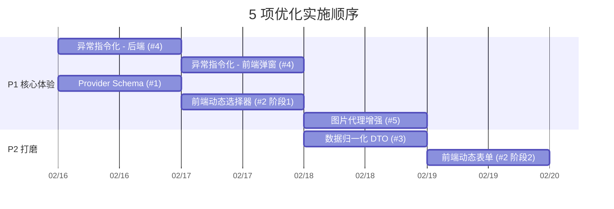

# Scraper 5 项前后端优化方案评估

> **日期**: 2026-02-15 | **基线**: scraper-v2-refactor（codex/scraper-v2-refactor-20260215）

---

## 总览与优先级矩阵

| # | 方案 | 价值 | 实施成本 | 与现状差距 | 推荐优先级 |
|:-:|------|:----:|:--------:|:----------:|:----------:|
| 1 | Provider Schema 自描述 | ⭐⭐⭐ | 🟢 低 | 中 — `ProviderAdapter` 有元数据骨架但缺 form_schema | **P1** |
| 2 | 前端动态表单渲染 | ⭐⭐⭐ | 🟡 中 | 大 — `ScraperConfig.vue` 硬编码了站点列表和表单 | **P1**（依赖 #1） |
| 3 | 数据归一化 DTO | ⭐⭐ | 🟢 低 | 小 — `MangaItem`/`ChapterItem` 已存在，需扩充字段 | **P2** |
| 4 | 异常指令化 (Actionable Errors) | ⭐⭐⭐⭐ | 🟡 中 | 中 — `error_code` 已有，缺 `action`/`payload` 指令 | **P1** |
| 5 | 后端图片代理增强 | ⭐⭐⭐ | 🟢 低 | 小 — 端点已存在，需增强 CF 回退和缓存策略 | **P1** |

---

## 逐项评估

### 1. Provider Schema 自描述

**现状**

```python
# providers.py:28-41 — 当前 ProviderAdapter
@dataclass(frozen=True)
class ProviderAdapter:
    key: str                    # ✅ 已有
    label: str                  # ✅ 已有
    hosts: tuple[str, ...]      # ✅ 已有
    supports_http: bool         # ✅ 已有
    supports_playwright: bool   # ✅ 已有
    supports_custom_host: bool  # ✅ 已有
    default_catalog_path: str   # ✅ 已有
    search: SearchFn            # ✅ 已有
    # ❌ 缺少: features, form_schema, status
```

**差距**

- 元数据骨架已搭好（key/label/hosts/supports_*），差距不大
- 缺少 `features: list[str]` — 前端不知道哪些 Provider 支持 search vs 仅支持 fetch_by_url
- 缺少 `form_schema: list[FieldDef]` — 无法驱动前端动态表单
- 已有 `GET /api/v1/scraper/providers` 端点（返回 provider 列表），但返回格式需扩展

**评估**

| 维度 | 评价 |
|------|------|
| 方向正确性 | ✅ 完全正确，符合插件化设计的自然演进 |
| 扩展工作量 | 🟢 低 — 在 `ProviderAdapter` 加 2 个字段 + 更新注册代码 |
| 风险 | 无。新增字段对现有 API 向后兼容 |
| 依赖 | 无前置依赖 |

**建议调整**

- `status: "healthy"` 建议不放在静态注册里，改为运行时健康检查（可后期加）
- `form_schema` 的 `type` 枚举建议限定为 `string | select | boolean | number`，不要过度设计

---

### 2. 前端动态表单渲染

**现状**

```html
<!-- ScraperConfig.vue:46-50 — 硬编码站点列表 -->
<select v-model="scraper.state.site">
  <option value="toongod">ToonGod</option>
  <option value="mangaforfree">MangaForFree</option>
  <option value="custom">自定义</option>
</select>
```

前端 `providerMeta` 字段存在（显示 "可用 Provider"），但仅用于展示，未驱动表单。

**评估**

| 维度 | 评价 |
|------|------|
| 方向正确性 | ✅ 正确，消除"新增 Provider 必须改前端"的耦合 |
| "一行不改"的收益 | ⚠️ 部分成立 — 纯配置型字段（URL/Cookie/语言）确实零改动；但复杂交互（如 OAuth 登录流）仍需前端定制 |
| 工作量 | 🟡 中 — 需要重写 ScraperConfig.vue 的站点选择和表单区域 |
| 风险 | 低。渐进式替换，可先做站点选择动态化，表单后续迭代 |

**建议调整**

- 第一阶段只做 **站点 `<select>` 动态化**（从 `/providers` 拉列表）和 **base_url 自动填充**（从 `hosts[0]` 取）
- 第二阶段再做完整 `form_schema` → `v-for` 渲染
- `ToggleSwitch` 等自定义组件需要一对一映射，建议用组件注册表模式

---

### 3. 数据归一化 DTO

**现状**

```python
# mangaforfree.py:26-39 — 已有的数据类
@dataclass(frozen=True)
class MangaItem:
    id: str           # ✅
    title: str        # ✅
    url: str          # ✅
    cover_url: str    # ✅
    # ❌ 缺少: author, status, source, description

@dataclass(frozen=True)
class ChapterItem:
    id: str           # ✅
    title: str        # ✅
    url: str          # ✅
    index: int        # ✅
    # ❌ 缺少: number (float), date, language
```

**评估**

| 维度 | 评价 |
|------|------|
| 方向正确性 | ✅ 完全正确 |
| 差距大小 | 🟢 **小** — 数据类已存在且在所有 Provider 中统一使用。只需扩充字段 + 给默认值 |
| 风险 | 低。新增可选字段不破坏现有契约 |

**建议调整**

- `MangaItem` 增加 `author: str = "Unknown"`、`status: str = "unknown"`、`source: str = ""`
- `ChapterItem` 增加 `number: float | None = None`、`date: str | None = None`
- 不建议在此阶段加 `description`（爬取成本高、大部分站无此数据）
- 命名建议不加 `manga_id` 前缀（当前 `id` 即可，`source` 字段区分来源）

---

### 4. 异常指令化 (Actionable Errors)

**现状**

```python
# v1_scraper.py — 已有的错误结构
_scraper_http_error(403, "SCRAPER_AUTH_CHALLENGE", str(exc))
# 返回: {"detail": {"error_code": "SCRAPER_AUTH_CHALLENGE", "message": "..."}}

# ❌ 缺少: action, payload
```

前端 store 中已有 Toast 错误展示，但无交互式弹窗响应。

**评估**

| 维度 | 评价 |
|------|------|
| 方向正确性 | ✅ **高度正确** — 这是刚完成的 FlareSolverr 级别 4（人在回路）的自然落地 |
| 与 FlareSolverr 的衔接 | 🔑 关键 — cf_solver 解盾失败时抛 `CloudflareChallengeError`，路由层捕获后目前只返回文本。加上 `action + payload` 就能闭环 |
| 工作量 | 🟡 中 — 后端改动小（扩展 error payload），前端需加全局拦截器 + ConfirmDialog |

**建议调整**

- `action` 枚举建议：`PROMPT_USER_COOKIE`、`PROMPT_USER_LOGIN`、`RETRY_AFTER`
- `payload` 结构：`{target_url, provider_id, cookie_keys: ["cf_clearance"]}`
- **前端实现路径**：Scraper 主链路使用 `authFetch`（基于 fetch API，见 `scraper.js:6`），非 axios。应在 `authFetch` 层统一解析响应中的 `action`/`payload`，或在各 store action 的 catch 块中检测 `error_code` 后弹出对应 Dialog → 用户提交 → `POST /api/v1/scraper/inject_cookies`（新端点）
- `resume_task` 不建议做 — 任务可以直接重试，不需要"暂停-恢复"语义（状态管理复杂度太高）

---

### 5. 后端图片代理增强

**现状**

> [!IMPORTANT]
> 端点 **已存在并在使用中**，初始评估有误。

- **后端**：`GET /api/v1/scraper/image` → `scraper_image()`
  - 已实现白名单校验：`provider_allows_image_host(provider, url, normalized_base)`
  - 当前通过 `get_http_client().fetch_binary()` 抓取，注入 Referer；增强方向是接入 `cf_solver` 实现 CF 403 回退
  - 已有认证：`Depends(require_auth)`
- **前端**：`proxyImageUrl()`（`scraper.js`）
  - 已有智能判断：同源/data:/blob: 跳过代理
  - 自动附加 `token`、`base_url`、`storage_state_path` 等参数

**需要增强的方面**

| 维度 | 现状 | 增强方向 |
|------|------|----------|
| CF 403 回退 | 直接返回 403 | 利用 `cf_solver` 获取 `cf_clearance` 后重试 |
| 缓存 | 无 Cache-Control 头 | 按 Provider 能力设置策略（见下） |
| 流式传输 | `fetch_binary` 全量加载 | 对大图（>1MB）考虑 `StreamingResponse` |
| 并发控制 | 独立于 HttpClient | 纳入域名级 Semaphore |

**Cache-Control 策略建议**

> [!WARNING]
> `Cache-Control: public, max-age=86400` 不宜作为默认值。若图片依赖 cookie/referer 鉴权，
> `public` 缓存可能导致未授权用户命中缓存或 CDN 缓存错误响应。

- **默认**：`private, max-age=3600`（安全保守，每小时过期）
- **静态 CDN 图片**（如 imgur/postimg 类）：可按 Provider 声明开启 `public, max-age=86400`
- 建议在 `ProviderAdapter` 中增加 `image_cache_public: bool = False` 字段控制

**工作量**

代码改动约 40-60 行，但加上测试（CF 回退场景、缓存头验证）和文档更新，总工时约 **0.5-1 天**。

---

## 实施顺序建议



| 阶段 | 内容 | 理由 |
|------|------|------|
| **P1 批次 A** | #4 异常指令化 | 与 FlareSolverr 级别 4 衔接，闭环 CF 解盾体验 |
| **P1 批次 B** | #1 + #2 阶段 1 | Provider 自描述 → 前端站点选择器动态化 |
| **P1 批次 C** | #5 图片代理增强 | CF 回退 + 缓存策略细化（端点已存在，增量改动） |
| **P2** | #3 + #2 阶段 2 | DTO 扩充 + 完整动态表单，属于锦上添花 |

---

## 与现有计划的关系

| 现有文档 | 关联 |
|---------|------|
| `scraper-v2-refactor-plan.md` | #1/#3 是 Phase 2（Provider 层）的自然延伸 |
| `flaresolverr-integration-plan.md` | #4 是 FlareSolverr 级别 4 的前端落地 |
| `qt-separation-plan.md` | #5 图片代理在 Qt 分离后更重要（纯 Web 前端无法绕过 CORS） |
