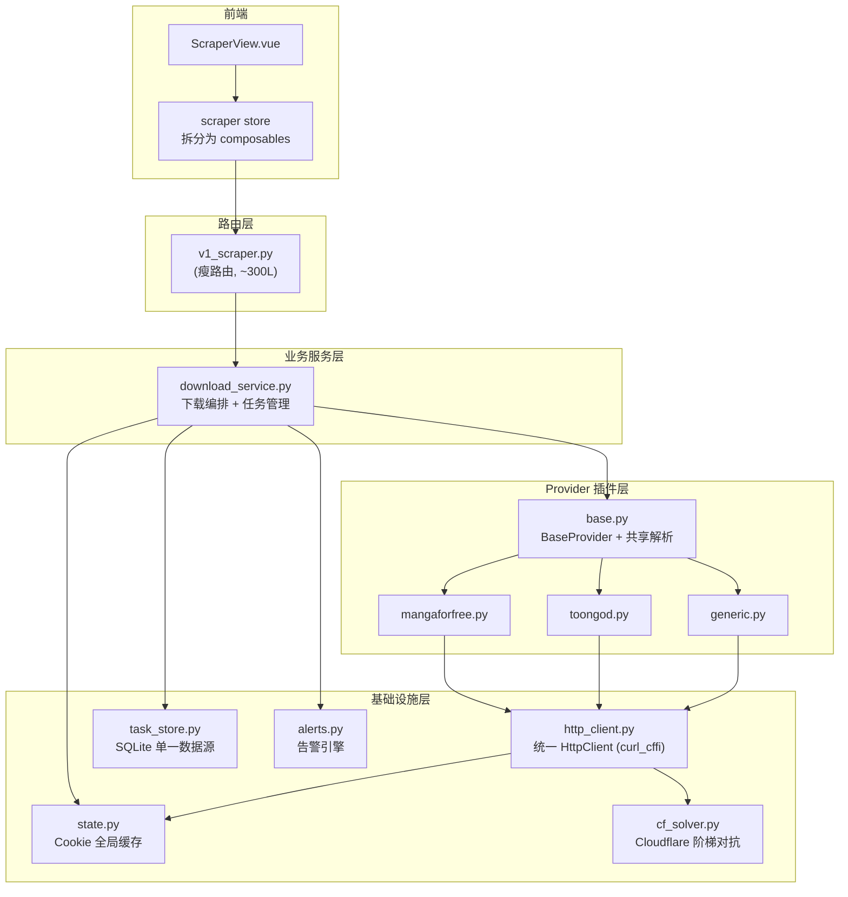
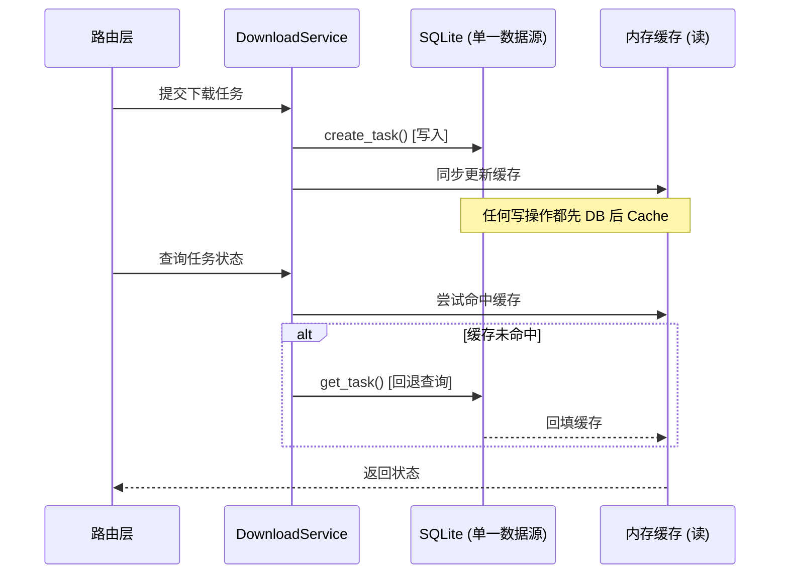
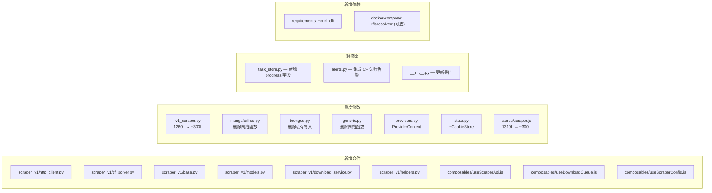
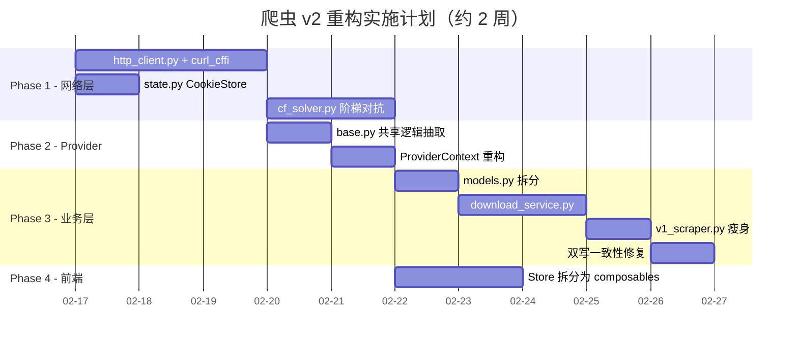

# 爬虫模块 v2 重构方案

> **日期**: 2026-02-15 | **状态**: 执行中（FlareSolverr 集成已落地到 v2 分支） | **预估总工时**: 约 2 周（单人）

---

## 问题摘要

当前爬虫模块（`scraper_v1`）功能完整，但存在以下核心架构问题：

1. **路由层膨胀**: `v1_scraper.py` 达 1260 行，混合模型/业务/状态/路由四重职责
2. **网络请求散落**: `mangaforfree.py`、`generic.py`、`v1_scraper.py` 各自创建 aiohttp session
3. **内存/SQLite 双写不一致**: 任务**创建**时 SQLite 失败会正确抛出 `SCRAPER_TASK_STORE_ERROR`，但任务**状态更新**时 SQLite 失败被静默吞掉（`v1_scraper.py:560-562`），服务重启可能丢失中间状态
4. **私有函数跨模块耦合**: `toongod.py` 导入 `mangaforfree.py` 的 14 个符号（其中 8 个为 `_` 前缀私有函数，`toongod.py:10`）
5. **Cloudflare 对抗能力弱**: 裸 aiohttp 的 TLS 指纹极易被识别

---

## 总体架构（重构后）



---

## Phase 1: 统一网络层 + Cloudflare 对抗（8h）

> 这是收益最大、最优先的改动。

### 1.1 新建 `scraper_v1/http_client.py` — 统一 HttpClient

**目标**: 所有 HTTP 请求收敛到一个入口，消除散落的 `aiohttp.ClientSession` 创建。

```python
class ScraperHttpClient:
    """全局唯一的爬虫 HTTP 客户端"""

    def __init__(self, default_user_agent: str, cookie_store: CookieStore):
        self._cookie_store = cookie_store
        self._domain_semaphores: dict[str, asyncio.Semaphore] = {}
        self._default_ua = default_user_agent

    async def fetch_html(self, url, *, cookies=None, user_agent=None, referer=None) -> str:
        """统一 HTML 获取，自动注入 cookies/referer/UA"""

    async def download_binary(self, url, output_path, *, referer, cookies=None) -> DownloadResult:
        """统一二进制下载（图片等），自动限流"""
```

**核心能力**:

| 能力 | 实现方式 |
|------|---------|
| TLS 指纹伪装 | 底层使用 `curl_cffi.requests.AsyncSession(impersonate="chrome120")`，通过 feature flag 灰度切换 |
| 域名级并发限流 | 每个域名独立 `asyncio.Semaphore`，可配置 |
| Cookie 自动注入 | 从 `CookieStore` 读取当前域名有效 Cookie |
| Referer 自动填充 | 下载时强制带上来源页面 URL |
| 超时与重试 | 内置分级重试策略 |

**影响范围**:

| 文件 | 改动 |
|------|------|
| `mangaforfree.py` | 删除 `_fetch_html()`，改为调用 `HttpClient.fetch_html()` |
| `generic.py` | 删除 `_fetch_html_http()` + `_fetch_html_playwright_sync()`，改为调用 HttpClient |
| `toongod.py` | 不再导入 `mangaforfree._fetch_html`，改为使用 HttpClient |
| `v1_scraper.py` | 删除 `_download_image()` 函数，改为调用 `HttpClient.download_binary()` |

### 1.2 Feature Flag 灰度策略

> [!IMPORTANT]
> `curl_cffi` 切换不可一次性全量替换。通过环境变量控制灰度：

```python
# http_client.py
USE_CURL_CFFI = os.environ.get("SCRAPER_HTTP_ENGINE", "aiohttp")  # "aiohttp" | "curl_cffi"
```

- **Phase 1 初期**：默认 `aiohttp`，手动开启 `curl_cffi` 验证
- **Phase 1 稳定后**：默认 `curl_cffi`，保留 `aiohttp` 回退
- **最终**：移除 `aiohttp` 代码路径

### 1.3 新建 `scraper_v1/cf_solver.py` — Cloudflare 阶梯对抗

**策略**: 遇到 CF 时自动升级对抗级别，对调用方透明。

```
级别 1: curl_cffi TLS 伪装（默认，零额外开销）
    ↓ 若返回 503 challenge
级别 2: FlareSolverr 旁路解盾（可选 sidecar 容器）
    ↓ 若 FlareSolverr 不可用或失败
级别 3: 暂停任务 + 前端告警，请求人工注入 Cookie
```

```python
class CloudflareSolver:
    async def solve(self, url: str, current_cookies: dict) -> SolveResult:
        """
        返回 SolveResult(cookies=..., html=..., level_used=...)
        自动按级别尝试，失败时触发告警
        """
```

**关键设计决策**:

| 决策 | 选择 | 理由 |
|------|------|------|
| FlareSolverr 是否必须 | **可选** | 通过环境变量 `FLARESOLVERR_URL` 控制，不配置则跳过 |
| DrissionPage 是否集成 | **延后** | 不适合 Docker 部署，先不做 |
| Cookie 有效期管理 | Cookie 获取后缓存到 `CookieStore`，自动检测过期 | 避免每次请求都过盾 |

### 1.3 增强 `scraper_v1/state.py` — Cookie 全局缓存

在现有 `state.py` 基础上增加**内存缓存层**：

```python
class CookieStore:
    """跨任务、跨请求的 Cookie 缓存管理"""

    def get_cookies(self, domain: str) -> dict[str, str]
    def update_cookies(self, domain: str, cookies: dict[str, str], expires_at: float | None)
    def invalidate(self, domain: str)
```

替代现有 `_merge_cookies()` 每次从文件系统重新读取的做法。

---

## Phase 2: Provider 基类重构 + 共享逻辑抽取（4h）

### 2.1 新建 `scraper_v1/base.py` — 抽取共享解析逻辑

从 `mangaforfree.py` 提取以下私有函数到公共模块：

| 函数 | 用途 | 当前被谁导入 |
|------|------|-------------|
| `_infer_slug()` | URL → slug | toongod, generic |
| `_normalize_url()` | 相对→绝对 URL | toongod, generic |
| `_canonical_series_url()` | 规范化系列 URL | toongod, generic |
| `_looks_like_challenge()` | 检测 CF 挑战页 | toongod, generic（迁移到 cf_solver） |
| `_request_headers()` | 构造请求头 | toongod（迁移到 HttpClient） |
| `_fetch_html()` | HTTP 获取 HTML | toongod（迁移到 HttpClient） |
| `_extract_ajax_config()` | WP AJAX 配置提取 | toongod |
| `_fetch_chapters_via_ajax()` | AJAX 获取章节 | toongod |
| `parse_catalog_has_more()` | 分页检测 | toongod, generic |

### 2.2 规范化 Provider 接口

保留现有 `ProviderAdapter` dataclass 模式（不迁移到 ABC），但改善调用方式：

```python
@dataclass
class ProviderContext:
    """统一的请求上下文，替代 6 个位置参数"""
    base_url: str
    cookies: dict[str, str]
    user_agent: str
    http_mode: bool
    force_engine: str | None

@dataclass(frozen=True)
class ProviderAdapter:
    key: str
    label: str
    hosts: tuple[str, ...]
    # ... 元数据字段保留 ...
    search: Callable[[ProviderContext, str], Awaitable[list[MangaItem]]]
    catalog: Callable[[ProviderContext, int, str | None, str | None], Awaitable[tuple[list[MangaItem], bool]]]
    chapters: Callable[[ProviderContext, str], Awaitable[list[ChapterItem]]]
    reader_images: Callable[[ProviderContext, str], Awaitable[list[str]]]
```

> [!NOTE]
> **为什么不用 ABC?** 现有 dataclass 函数式组合已经足够灵活，且避免了继承层次复杂化。`ProviderContext` 解决了位置参数容易传错的核心问题。

---

## Phase 3: 路由层瘦身 + 任务管理重构（8h）

### 3.1 拆分 `v1_scraper.py`

将 1260 行拆为 4 个文件：

| 新文件 | 职责 | 预估行数 |
|--------|------|:--------:|
| `routes/v1_scraper.py` | 纯路由处理（参数校验 + 调用服务 + 返回响应） | ~300 |
| `scraper_v1/models.py` | 所有 Pydantic 请求/响应模型 | ~120 |
| `scraper_v1/download_service.py` | 下载编排、任务状态机、重试调度 | ~350 |
| `scraper_v1/helpers.py` | 工具函数（`_safe_name`, `_normalize_catalog_path` 等） | ~80 |

### 3.2 修复双写一致性

**改为以 SQLite 为单一写入源，内存仅作读缓存**：



### 3.3 下载任务增加断点续传 + 实时进度

```python
# download_service.py 中的 worker
async def worker(index: int, image_url: str):
    output_path = output_dir / f"{index:03d}{ext}"
    if output_path.exists() and output_path.stat().st_size > 0:
        return  # 断点续传：跳过已下载

    result = await http_client.download_binary(...)

    # 实时进度上报
    await self._update_progress(task_id, completed=current, total=total)
```

### 3.4 Task 引用管理

```python
# download_service.py
class DownloadService:
    _active_tasks: set[asyncio.Task] = set()

    def submit(self, coro):
        task = asyncio.create_task(coro)
        self._active_tasks.add(task)
        task.add_done_callback(self._active_tasks.discard)

    async def shutdown(self):
        for task in self._active_tasks:
            task.cancel()
        await asyncio.gather(*self._active_tasks, return_exceptions=True)
```

---

## Phase 4: 前端 Store 拆分（4h）

将 `scraper.js`（1319L）拆为：

| 新文件 | 职责 | 预估行数 |
|--------|------|:--------:|
| `composables/useScraperApi.js` | API 调用层 + 错误映射 | ~200 |
| `composables/useDownloadQueue.js` | 下载队列调度 + 轮询 | ~250 |
| `composables/useScraperConfig.js` | 站点/模式/UA 配置管理 | ~200 |
| `stores/scraper.js` | 状态聚合 + UI 辅助计算 | ~300 |

---

## 文件变动总览



---

## 实施顺序与依赖



---

## 验证计划

### 自动化测试

```bash
# 现有后端测试（必须全部通过）
pytest tests/test_v1_scraper_phase2.py tests/test_v1_scraper_phase3.py tests/test_v1_scraper_phase4.py -v

# 现有前端测试（必须全部通过）
cd frontend && npm test
```

### 冒烟测试

| 测试项 | 方法 | 覆盖点 |
|--------|------|--------|
| ToonGod 搜索 | 前端输入关键词搜索 | HttpClient + curl_cffi + Provider |
| 章节下载 | 选择一章下载 | 下载服务 + 断点续传 + 进度上报 |
| Cookie 注入 | 上传状态文件后重新搜索 | CookieStore + state.py |
| CF 403 回退 | Mock 一个 503 响应 | cf_solver 阶梯逻辑 |
| 任务查询 | 重启服务后查询历史任务 | SQLite 单一数据源 |
| 前端 Store | 各 composable 功能正常 | Store 拆分不丢功能 |

---

## 风险与缓解

| 风险 | 级别 | 缓解措施 |
|------|:----:|----------|
| `curl_cffi` 在 Docker alpine 上编译失败 | 🟡 中 | 使用 `python:3.12-slim`（已有 glibc），pip 提供预编译 wheel |
| FlareSolverr 内存开销大 | 🟢 低 | 设为可选 sidecar，不嵌入主容器 |
| 路由拆分引入回归 | 🟡 中 | 每个 Phase 完成后跑全量测试 |
| 前端 store 拆分遗漏响应式引用 | 🟡 中 | `npm test` + 手动冒烟测试 |
| Provider 函数签名变更影响测试 | 🟢 低 | 测试使用 mock，签名变更不影响 |

---

## 补充：原方案遗漏事项

### 补充 1：Admin 路由与 Scraper 路由的关系

Scraper 的 Admin 级端点（tasks/metrics/health/alerts/queue）**已经独立存在于 `admin.py`**（`admin.py:469-595`），使用 `/admin/scraper/*` 前缀，并非在 `v1_scraper.py` 中。前端由 `adminScraper.js`（249L）驱动。

当前状态：

| 端点 | 所在文件 |
|------|----------|
| `/api/v1/scraper/*`（search/catalog/chapters/download/task） | `routes/v1_scraper.py` |
| `/admin/scraper/*`（tasks/metrics/health/alerts/queue） | `routes/admin.py` |

Phase 3 拆分 `v1_scraper.py` 时，Admin 路由**无需额外处理**（已经分离）。但需注意两个路由文件共享 `_get_task_store()` 等内部依赖，重构后应改为从 `download_service.py` 统一暴露接口。

> [!WARNING]
> 现有 `/admin/scraper/*` 路由契约已被前端 `adminScraper.js` 使用，**不可变更 prefix**。

---

### 补充 2：Parser 模块与 HttpClient 统一

`v1_parser.py`（249L）是与爬虫紧密关联的 URL 解析模块，前端 `scraper.js` 的 `parseUrl()` 直接调用它。但它**独立使用 `httpx` 同步客户端（在线程池中执行）做 HTTP 请求**，不走 `aiohttp`，也不走未来的 `HttpClient`：

```python
# v1_parser.py:34,48 — 用的是 httpx.Client + asyncio.to_thread
def _fetch_html_sync(url, ...):
    with httpx.Client(...) as client:
        resp = client.get(url, ...)

async def _fetch_html(url, ...):
    return await asyncio.to_thread(_fetch_html_sync, url, ...)
```

**建议**：Phase 1 统一 HttpClient 时，`v1_parser.py` 也应改为调用 `ScraperHttpClient.fetch_html()`，共享 TLS 伪装、Cookie 注入和限流能力。否则 Parser 仍然用裸 httpx，会成为 CF 拦截的软肋。

---

### 补充 3：封面图片代理端点

`/api/v1/scraper/image` 是一个重要的代理端点，前端用它来代理加载漫画封面（绕过 CORS 和防盗链）：

```javascript
// scraper.js:638
return `/api/v1/scraper/image?${params.toString()}`
```

该端点内部也自建 `aiohttp.ClientSession`（`v1_scraper.py:1249`）。Phase 1 统一 HttpClient 时需特别注意：
- 图片代理需支持**流式响应**（不能先下载到内存再返回）
- 需保留对 `provider_allows_image_host()` 的安全检查（防止被滥用为开放代理）
- `HttpClient.download_binary()` 设计时需支持"流式代理"模式，而非仅"下载到文件"

---

### 补充 4：与 Qt 分离计划的执行顺序

当前正在 worktree `codex/qt-separation-20260215` 中并行实施 [Qt 分离方案](file:///Users/xa/Desktop/projiect/manga-translator-ui_副本/docs/refactoring/qt-separation-plan.md)。两个重构在以下文件存在并行改动冲突：

| 冲突文件 | Qt 分离改动 | Scraper v2 改动 |
|----------|-----------|----------------|
| `manga_translator/server/main.py` | locales 路径迁移、新增 `locales_router` | `download_service` 初始化、路由瘦身后的导入变更 |
| `manga_translator/server/routes/__init__.py` | 新增 `locales_router` 导出 | 导出列表随路由瘦身可能变更 |

> [!NOTE]
> Admin 路由已独立在 `admin.py` 中（见补充 1），此处不涉及 admin 路由拆分动作。

**建议执行顺序**：
1. **先完成 Qt 分离**（已在进行中），合入 main
2. **再启动 Scraper v2**，基于合入后的代码开始

---

### 补充 5：task_store.py 的 DB Migration

新增"实时进度"字段（`progress_completed`、`progress_total`）需要 SQLite schema 变更。`ScraperTaskStore` 已有 `_ensure_migrations()` 机制（`task_store.py:126`），会自动 `ALTER TABLE ADD COLUMN`：

```python
_EXTRA_COLUMNS: dict[str, str] = {
    "retry_count": "INTEGER NOT NULL DEFAULT 0",
    "max_retries": "INTEGER NOT NULL DEFAULT 2",
    # ... 现有迁移
}
```

Phase 3 新增进度字段时，只需在 `_EXTRA_COLUMNS` 中追加：

```python
"progress_completed": "INTEGER NOT NULL DEFAULT 0",
"progress_total": "INTEGER NOT NULL DEFAULT 0",
```

现有的自动迁移机制会在启动时检测并添加缺失列，**无需手动迁移脚本**。但需验证生产环境的 `scraper_tasks.db` 能否正常迁移。

---

### 补充 6：rate_limit_rps 与 concurrency 概念区分

当前代码中 `concurrency`（并发数） 和 `rate_limit_rps`（每秒请求数）是两个独立的前端配置，但后端只实现了 concurrency（通过 `asyncio.Semaphore`），**`rate_limit_rps` 实际上没有生效**：

```python
# v1_scraper.py:745 — 只用了 concurrency，rate_limit_rps 未使用
connector = aiohttp.TCPConnector(limit=max(1, min(32, int(req.concurrency or 6))))
```

统一 HttpClient 时需区分清楚：

| 概念 | 含义 | 实现方式 |
|------|------|---------|
| **concurrency** | 同一时刻最大并发连接数 | `asyncio.Semaphore(N)` |
| **rate_limit_rps** | 每秒最大请求次数 | 令牌桶或滑动窗口（需新增实现） |

两者缺一不可：仅有 concurrency 限制并发数但不限速率，6 个并发请求可能在 100ms 内全部发出，触发目标站点的频率封禁。
